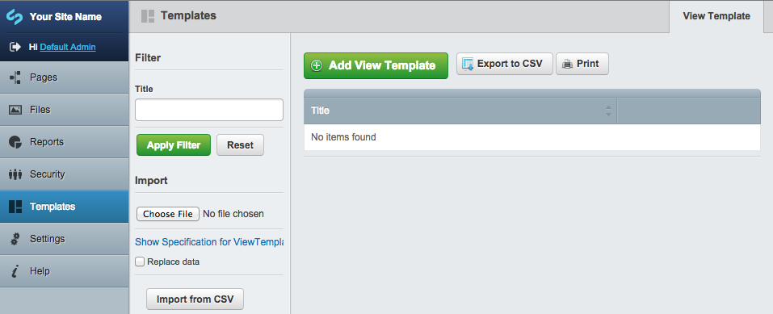
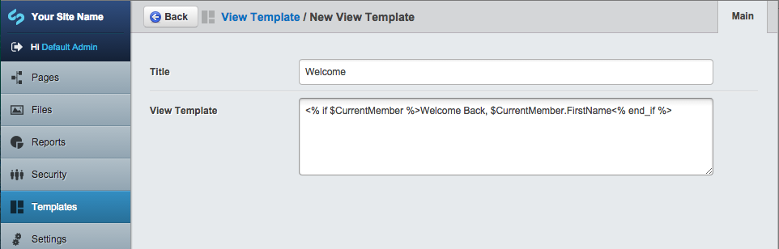
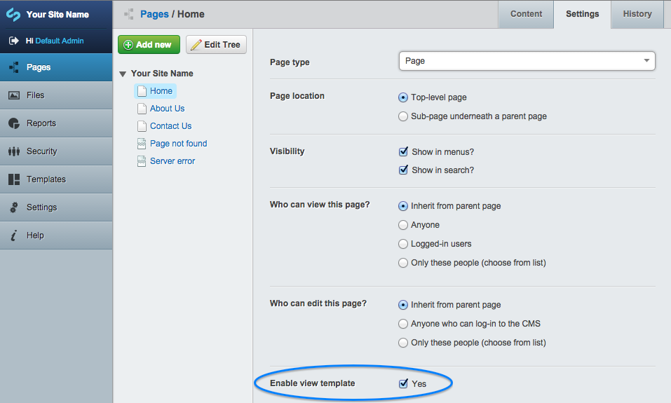
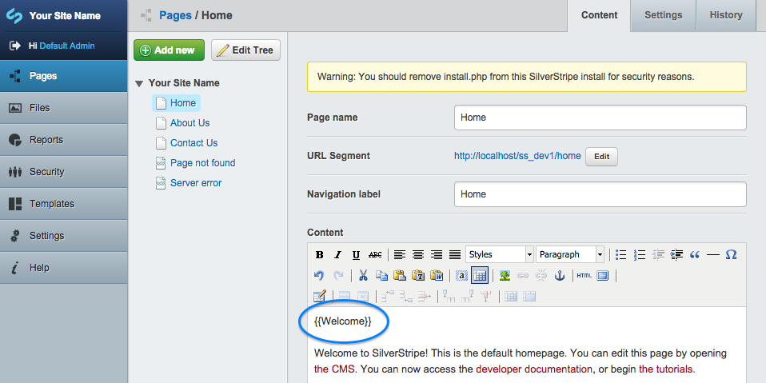
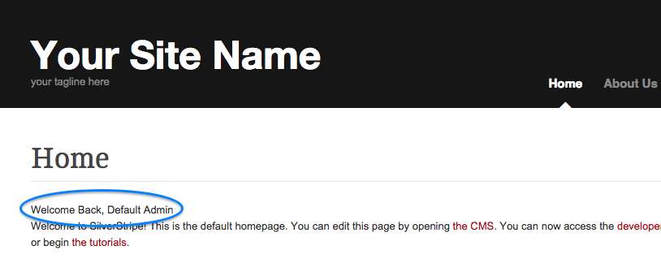

How to use View Template (silverstripe-viewtemplate)
==============

### Create a view template
On the first column of the CMS administration view there is a menu item labelled **Templates**. 

- Click on the menu to open the templates management interface.

Click on the **Add View Template** Green button to open the add form.
There are 2 simple fields:

- Title: The name of your template.
- View Template: The content of the template. This field can contains SilverStripe template syntax.

### Using view template in your page content

Assuming that you have created a view template with the following details:

- Title:         `Welcome`
- View Template: `<% if $CurrentMember %>Welcome Back, $CurrentMember.FirstName<% end_if %>`

Open the **Settings** tab of the page you are creating. By default the module is disabled unless you have ticked the option **Enable view template**

Now in the HTML editor of the page, add the placeholder of the view template you want to include in the page. The placeholder format is `{{Your template title}}`.

Save the current page and publish it. Your public site should look as follows:

